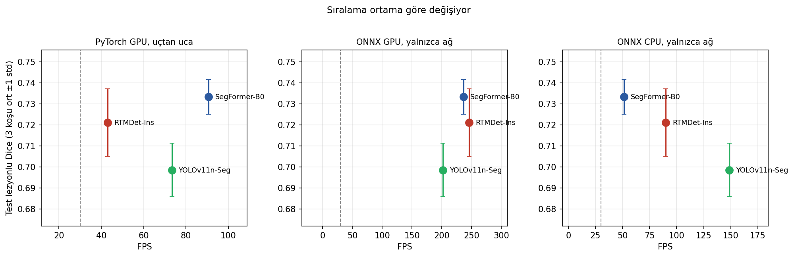
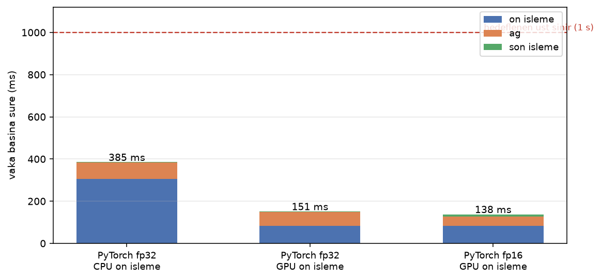
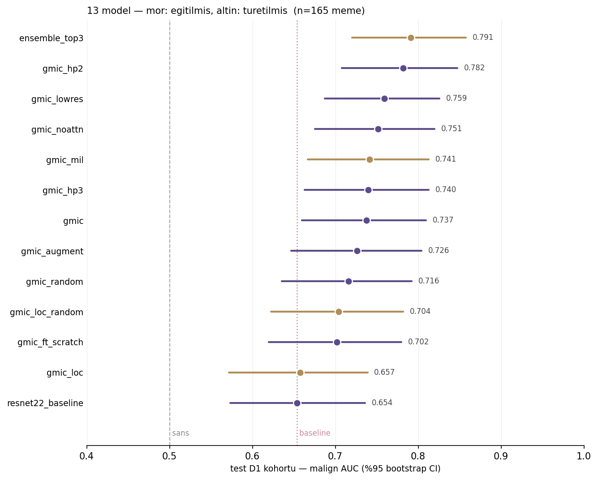

# Medikal Görüntü Analizi — Staj Çalışmaları

Mamografi, meme ultrasonu ve beyin MR verilerinde **tespit, segmentasyon ve sınıflandırma** modelleri;
her biri kendi sonuç raporuyla birlikte. Beş bağımsız alt proje, ortak bir yaklaşımla yürütüldü:
önce veriye bak, sonra karşılaştırmayı adil kur, sonuçları istatistikle destekle, optimizasyona
ölçerek başla.

> Yaz stajı kapsamında yapılmıştır. Kullanılan veri setlerinin tamamı **kamuya açık araştırma
> veri setleridir**; hasta verisi ve model ağırlıkları bu depoda yer almaz.

---

## Alt projeler

| Klasör | Konu | Modalite | Veri |
|---|---|---|---|
| [`mass_lezyon_projesi/`](mass_lezyon_projesi) | Kitle lezyonu **tespiti** | Mamografi | VinDr-Mammo türevi, 3.340 görüntü / 4.021 kutu |
| [`mendeley_data_density/`](mendeley_data_density) | Meme yoğunluğu **segmentasyonu** | Mamografi | Behravan vd. (2024), Mendeley Data |
| [`real_time_segmentasyon/`](real_time_segmentasyon) | Gerçek zamanlı lezyon **segmentasyonu** | Ultrason | BUSI |
| [`iskemik_inme/`](iskemik_inme) | İnme lezyonu **segmentasyonu** + çıkarım servisi | MR (DWI/ADC/FLAIR) | ISLES-2022 |
| [`multiple_instance_classifier/`](multiple_instance_classifier) | Zayıf denetimli **sınıflandırma** (GMIC yeniden üretimi) | Mamografi | CMMD2022 |
| [`egitim/`](egitim) | DICOM okuma, ön işleme, CLAHE, augmentasyon, veri kalitesi hattı | Mamografi | INbreast |
| [`literatur_taramasi/`](literatur_taramasi) | 2020–2026 literatür değerlendirmesi | — | — |

---

## Öne çıkan sonuçlar

### 1. Kitle lezyonu tespiti — üç mimari, aynı veri

Üç dedektör aynı bölme ve aynı ön işlemeyle eğitilip karşılaştırıldı.

| Model | mAP@50 | mAP@50-95 | Precision | Recall |
|---|---|---|---|---|
| **RF-DETR-S** | **0.7551** | — | — | **0.815** |
| YOLO11s | 0.6928 | 0.3820 | 0.7475 | 0.6365 |
| YOLO26s | 0.6914 | — | — | — |

Meme dokusunu arka plandan ayıran kırpma ön işlemesi, optimizer karşılaştırması (SGD / AdamW) ve
YOLO modelleri için Grad-CAM görselleştirmesi dahil.
→ [Sonuç raporu](mass_lezyon_projesi/mass_lezyon_sonuc_raporu.pdf)

### 2. Gerçek zamanlı ultrason segmentasyonu — kalite ve hız birlikte

Üç mimari, üçer farklı rastgele başlangıçla, toplam **dokuz koşu**; tek ortamda ölçüldü.

| Model | Dice (lezyonlu) | GPU FPS | Medyan gecikme |
|---|---|---|---|
| **SegFormer-B0** | **0.7335 ± 0.0083** | **90.7** | 11.0 ms |
| RTMDet-Ins-tiny | 0.7212 ± 0.0160 | 43.0 | 23.3 ms |
| YOLOv11n-Seg | 0.6986 ± 0.0127 | 73.3 | 13.7 ms |

SegFormer-B0'ın YOLOv11n-Seg'e üstünlüğü istatistiksel olarak anlamlı (+0.035, p = 0.003);
RTMDet ile SegFormer arasında ayırt edilebilir fark yok. Modeller **nerede** iyi oldukları
bakımından ayrışıyor: küçük lezyonlarda SegFormer, 220 pikselin üstünde RTMDet önde.

Veri sızıntısına karşı korelasyonu 0.95 üzerindeki kopya kareler tespit edilip bölme **grup
düzeyinde** yapıldı; Dice orijinal çözünürlükte ölçüldü.



→ [Sonuç raporu](real_time_segmentasyon/rapor/rt_seg_sonuclari_raporu.pdf)

### 3. İnme segmentasyonu — optimizasyona ölçerek başlamak

Bu projenin asıl bulgusu bir model sonucu değil, bir **ölçüm dersi**:

> Optimizasyon planı tamamen modeli hedefliyordu, ama ölçüm sürenin **dörtte üçünün ön işlemede**
> geçtiğini gösterdi. Plan değiştirildi; yeniden örnekleme ve beyin maskesi GPU'ya taşındı.
> Vaka başına süre **385 ms → 138 ms**.
>
> ONNX ve TensorRT izole ölçümde hızlı görünmelerine rağmen gerçek hatta kazanç vermedi ve
> yığından çıkarıldı — 3B model vaka başına tek ileri geçiş yapıyor, amorti edilecek çerçeve
> yükü yok.

Kalite tarafında denenen hiçbir varyant en basit taban modeli geçemedi. Ortalama Dice'ın gizlediği
asıl örüntü lezyon boyutunda: küçük lezyonlarda 0.564, büyükte 0.823.



Model, ham dosyalardan lezyon maskesi, hacim ve lezyon sayısı üreten bir
[çıkarım servisine](iskemik_inme/servis) bağlandı.
→ [Sonuç raporu](iskemik_inme/rapor/isles_sonuc_raporu.pdf)

### 4. Meme yoğunluğu segmentasyonu — altı model, sabit protokol

Dört mimari (U-Net, U-Net++, DeepLabV3+, SegFormer) ve üç encoder ailesi (ResNet, EfficientNet,
Mix Transformer) birleştirilerek altı model eğitildi; veri bölünmesi, ön işleme, augmentasyon ve
kayıp fonksiyonu tüm modellerde sabit tutuldu.

**En iyi: U-Net + ResNet34** — Dice 0.8059 · IoU 0.6922 · Precision 0.8153 · Recall 0.8392

Ayrıca en iyi model üzerinde [hiperparametre optimizasyonu](mendeley_data_density/rapor/hpo_sonuc_raporu.pdf)
yürütüldü.
→ [Sonuç raporu](mendeley_data_density/rapor/density_segmentation_sonuc_raporu.pdf)

### 5. GMIC yeniden üretimi — makale iddiası küçük veride de geçerli mi?

Shen ve ark. (MLMI 2019) yönteminin CMMD2022 üzerinde yeniden üretimi. Ana bulgu: GMIC, aynı
backbone'u kullanan ResNet-22 taban çizgisini **0.083 AUC** farkıyla aşıyor (p = 0.024) — makalede
bildirilen fark 0.073 iken, veri seti yaklaşık **120 kat küçük** olmasına rağmen aynı büyüklükte
kazanç. Hiperparametre aramasından çıkan ilk üç konfigürasyonun ensemble'ı **0.791 AUC** ile en
yüksek sonucu veriyor (p = 0.029).

Modelin görmediği ama görüntülerin dolaylı taşıdığı değişkenler için confounder taban çizgileri
çıkarıldı; AUC'ler bunlara karşı okundu.



→ [Sonuç raporu](multiple_instance_classifier/rapor/gmic_cmmd_sonuc_raporu.pdf)

---

## Depoda ne var, ne yok

**Var:** eğitim ve değerlendirme defterleri, ön işleme ve ölçüm script'leri, çıkarım servisi,
her alt proje için PLAN.md (karar günlüğü) ve sonuç raporu (PDF), rapor figürleri, ölçüm tabloları.

**Yok:** veri setleri (kamuya açık kaynaklarından indirilmeli), model ağırlıkları (`.pt`/`.pth`),
sanal ortamlar. Hepsi `.gitignore` kapsamında.

Veri setleri: [VinDr-Mammo](https://physionet.org/content/vindr-mammo/) ·
[CMMD](https://www.cancerimagingarchive.net/collection/cmmd/) ·
[BUSI](https://scholar.cu.edu.eg/?q=afahmy/pages/dataset) ·
[ISLES-2022](https://isles22.grand-challenge.org/) ·
[INbreast](https://www.kaggle.com/datasets/tommyngx/inbreast2012) ·
[Mendeley breast density](https://data.mendeley.com/)

## Kurulum

```bash
python -m venv .venv && .venv/Scripts/activate   # Linux/macOS: source .venv/bin/activate
pip install -r requirements.txt
```

Alt projelerin ek bağımlılıkları (mmdetection, ultralytics, rfdetr, transformers) kendi
klasörlerindeki `PLAN.md` dosyalarında belirtilmiştir.

## Yöntem notları

- **Adil karşılaştırma:** aynı veri bölünmesi, aynı ön işleme, aynı değerlendirme protokolü;
  model-spesifik hiperparametreler kontrollü biçimde ayarlandı.
- **İstatistiksel destek:** çok tohumlu koşular, eşleştirilmiş testler, güven aralıkları;
  "şu model daha iyi" cümlesi p değeri olmadan kurulmadı.
- **Ölçüm disiplini:** hız karşılaştırmalarında ön işleme / ileri geçiş / son işleme ayrı ayrı
  raporlandı; ONNX çıktılarının PyTorch ile sayısal denkliği doğrulanmadan hız kıyası yapılmadı.
- **Karar günlüğü:** her alt projede `PLAN.md`, denenen ve **reddedilen** yaklaşımları gerekçesiyle
  birlikte tutuyor.
